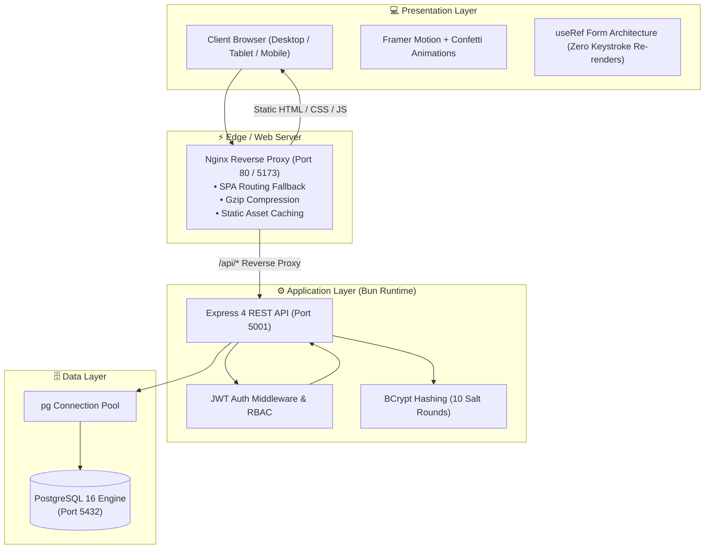
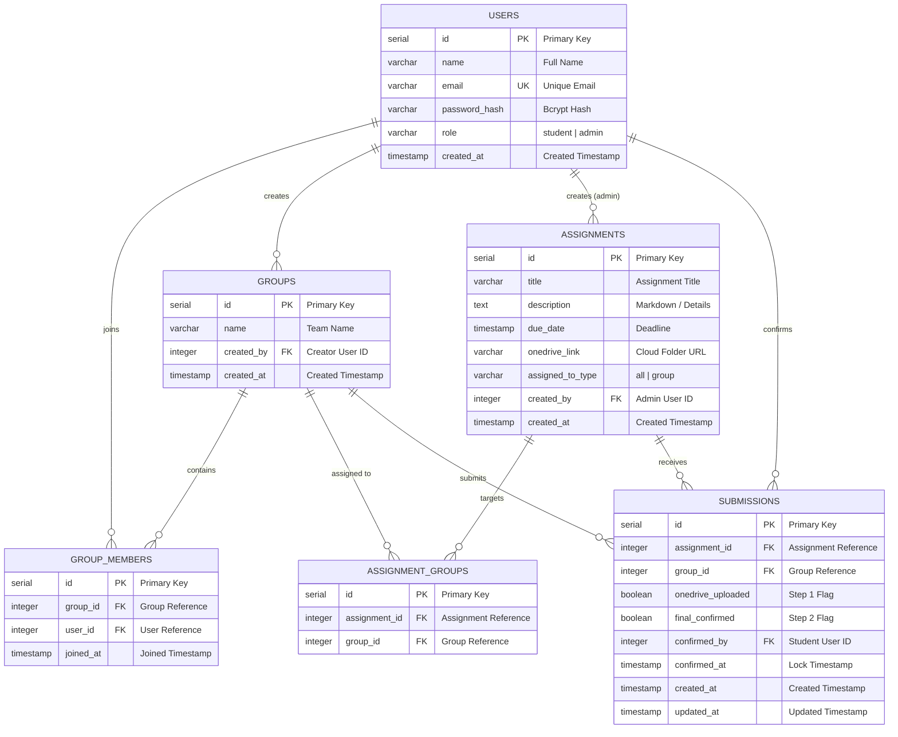

<div align="center">

# 🎓 GroupSync
### *Next-Generation Academic Student Group & Assignment Management System*

[](https://bun.sh)
[](https://react.dev)
[](https://www.typescriptlang.org)
[](https://expressjs.com)
[](https://www.postgresql.org)
[](https://tailwindcss.com)
[](https://www.docker.com)
[](https://www.framer.com/motion)

<p align="center">
  <b>Seamless Collaboration</b> • <b>Two-Step Verified Submissions</b> • <b>Real-Time Analytics Matrix</b> • <b>Cloud Storage Sync</b>
</p>

[✨ Live Features](#-feature-highlights) • [🏛 Architecture](#-system-architecture) • [🗄 Database Schema](#-entity-relationship-er-diagram) • [🚀 Quick Start](#-quick-start-guide) • [📡 API Reference](#-rest-api-reference)

---

</div>

## 🌟 Overview

**GroupSync** is a modern, enterprise-ready academic management platform engineered to eliminate group project chaos in universities and educational programs. 

It empowers students to assemble project teams, invite peers, and execute verified two-step submissions linked to cloud storage repositories (e.g., OneDrive, Google Drive). Simultaneously, it arms professors and administrators with deep real-time analytics, automated assignment distribution (broadcast or targeted), and a live group×assignment progress matrix.

---

## ✨ Feature Highlights

<table>
  <tr>
    <td width="50%" valign="top">
      <h3>🧑‍🎓 Student Portal</h3>
      <ul>
        <li>🚀 <b>Interactive Hub</b>: Live metric counters for enrolled teams, active assignments, completed deliverables, and overdue alerts.</li>
        <li>👥 <b>Team Management</b>: One-click group creation, real-time member invitations by email, role assignments, and roster inspection.</li>
        <li>📤 <b>Two-Step Verified Submissions</b>:
          <ul>
            <li><b>Step 1</b>: Direct OneDrive repository access & upload verification checkbox.</li>
            <li><b>Step 2</b>: Final group confirmation lock with celebration confetti.</li>
          </ul>
        </li>
        <li>⚡ <b>Fluid Motion & Navigation</b>: Mobile drawer navigation, staggered card entrances, and zero-rerender <code>useRef</code> form state architecture.</li>
      </ul>
    </td>
    <td width="50%" valign="top">
      <h3>🛡️ Administrator Suite</h3>
      <ul>
        <li>📊 <b>Executive Dashboard</b>: Global completion rates, total enrolled students, active groups, and per-assignment progress bars.</li>
        <li>📝 <b>Assignment Lifecycle Management</b>:
          <ul>
            <li>Create, edit, and delete assignments with transactional cascading.</li>
            <li>Flexible targeting: <b>Broadcast to All</b> or <b>Target Specific Groups</b>.</li>
            <li>Cloud storage link attachment and deadline scheduling.</li>
          </ul>
        </li>
        <li>🔍 <b>Live Submission Matrix</b>: Group-by-group submission tracker with status pills, confirmation timestamps, and student audit tags.</li>
        <li>📂 <b>Institutional Group Directory</b>: Deep-dive inspection of all student teams and group rosters.</li>
      </ul>
    </td>
  </tr>
</table>

---

## 🏛 System Architecture



---

## 🗄 Entity-Relationship (ER) Diagram



---

## 🛠 Tech Stack & Tooling

| Domain | Technology | Description |
|---|---|---|
| **Runtime & Toolchain** |  | Ultra-fast JavaScript & TypeScript runtime and package manager |
| **Frontend Framework** |  | Component-driven declarative UI |
| **Language** |  | End-to-end type safety across backend and frontend |
| **Styling & Theme** |  | Utility-first CSS engine with Material Design design tokens |
| **Motion & Micro-interactions** |  | Physics-based animations, layout transitions & `AnimatePresence` |
| **Icons & Visuals** |  | Consistent, modern stroke-based UI iconography |
| **Backend API** |  | Lightweight, performant Node/Bun HTTP server |
| **Database** |  | Enterprise relational database with connection pooling |
| **Security & Auth** |  | Cryptographic bearer auth, BCrypt password hashing |
| **Reverse Proxy** |  | High-performance SPA routing, Gzip compression & API proxy |
| **DevOps & Containers** |  | Multi-stage Alpine container orchestration |

---

## 🚀 Quick Start Guide

### 📦 Option 1: One-Command Docker Setup (Recommended)

Run the entire platform (Postgres, Backend, Frontend) with a single command:

```bash
# 1. Clone the repository
git clone https://github.com/Rishu7011/student-group-assignment-system.git
cd student-group-assignment-system

# 2. Build and launch all containers
docker-compose up --build -d
```

🎉 **Access the Running Stack:**
- 🌐 **Web Application**: [http://localhost:5173](http://localhost:5173) (or [http://localhost](http://localhost))
- 🔌 **Backend Health Endpoint**: [http://localhost:5001/api/health](http://localhost:5001/api/health)
- 🗄 **PostgreSQL Database**: `localhost:5432` (`sgas_db` / `sgas_user` / `sgas_pass`)

To stop all services:
```bash
docker-compose down
```

---

### 💻 Option 2: Local Development with Bun

#### 1. Database Initialization
Ensure PostgreSQL is active, then execute the schema migration:
```bash
psql -U postgres -c "CREATE DATABASE sgas_db;"
psql -U postgres -d sgas_db -f backend/migrations/001_init.sql
```

#### 2. Backend Server
```bash
cd backend
bun install
bun run dev
```
*Backend runs on `http://localhost:5001` with automated admin seeding.*

#### 3. Frontend Application
```bash
cd ../frontend
bun install
bun run dev
```
*Frontend runs on `http://localhost:5173` with Vite HMR.*

---

## 🔐 Default System Credentials

The backend automatically bootstraps an administrative user upon first boot:

| Role | Email | Password | Access Level |
|---|---|---|---|
| 👑 **System Administrator** | `sysadmin@groupsync.internal` | `Adm!n@GrpSync#2024` | Full platform management & analytics |
| 🧑‍🎓 **Student** | *Self-register at `/register`* | *Custom* | Group creation & assignment submission |

---

## 📡 REST API Reference

### 🔑 Authentication (`/api/auth`)
| Method | Endpoint | Description | Auth Level |
|---|---|---|---|
| `POST` | `/api/auth/register` | Register new student profile | Public |
| `POST` | `/api/auth/login` | Authenticate and obtain JWT token | Public |
| `GET` | `/api/auth/me` | Fetch authenticated session profile | Bearer JWT |

### 👥 Group Operations (`/api/groups`)
| Method | Endpoint | Description | Auth Level |
|---|---|---|---|
| `GET` | `/api/groups/mine` | List all groups the student belongs to | Student |
| `GET` | `/api/groups/all` | List all system groups with member counts | Admin |
| `GET` | `/api/groups/:id` | Fetch group roster & metadata | Authenticated |
| `POST` | `/api/groups` | Create a new student team | Student |
| `POST` | `/api/groups/:id/members` | Invite student by email | Team Member |
| `DELETE` | `/api/groups/:groupId/members/:userId` | Remove member from group | Team Creator |
| `DELETE` | `/api/groups/:id` | Delete entire student group | Team Creator |

### 📝 Assignment Management (`/api/assignments`)
| Method | Endpoint | Description | Auth Level |
|---|---|---|---|
| `GET` | `/api/assignments` | List assignments (with student group filter) | Authenticated |
| `GET` | `/api/assignments/:id` | Fetch assignment details & cloud links | Authenticated |
| `POST` | `/api/assignments` | Create broadcast or targeted assignment | Admin |
| `PUT` | `/api/assignments/:id` | Update assignment metadata & group targeting | Admin |
| `DELETE` | `/api/assignments/:id` | Delete assignment & cascade submissions | Admin |

### 📤 Submissions Flow (`/api/submissions`)
| Method | Endpoint | Description | Auth Level |
|---|---|---|---|
| `GET` | `/api/submissions/my-groups` | Retrieve user group submission statuses | Student |
| `GET` | `/api/submissions/assignment/:id` | Matrix view of all group submissions | Admin |
| `POST` | `/api/submissions/step1` | Toggle OneDrive upload verification | Team Member |
| `POST` | `/api/submissions/step2` | Final submission lock on behalf of group | Team Member |

### 📊 Analytics & Diagnostics (`/api/analytics`, `/api/health`)
| Method | Endpoint | Description | Auth Level |
|---|---|---|---|
| `GET` | `/api/analytics/overview` | Platform-wide KPIs & progress stats | Admin |
| `GET` | `/api/health` | Service health status check | Public |

---

## 💡 Key Architectural Decisions

1. **⚡ Zero-Rerender `useRef` Form Architecture**:
   All input forms (`Login`, `Register`, `GroupManagement`, `ManageAssignments`) leverage React `useRef` references rather than synchronous keystroke state, preventing costly re-renders on complex interactive views.
2. **🚀 Multi-Stage Alpine Containers**:
   Docker images build in an isolated Bun stage and export static artifacts directly to an ultra-lightweight `nginx:alpine` runner, keeping production image footprints under **50MB**.
3. **🔒 Atomic Transactional Operations**:
   Complex multi-row updates (e.g. creating/deleting assignments with targeted group associations) use PostgreSQL transactions (`BEGIN ... COMMIT`) to prevent orphaned records.
4. **🎨 Adaptive Responsive Drawer**:
   Custom responsive navigation automatically detects viewport widths `< 768px` and switches from fixed desktop sidebar to an animated slide-out drawer with backdrop blur.

---

## 📂 Project Directory Structure

```text
student-group-assignment-system/
├── backend/
│   ├── Dockerfile                  # Multi-stage Bun Alpine production image
│   ├── migrations/
│   │   └── 001_init.sql            # PostgreSQL schema & constraints
│   ├── src/
│   │   ├── config/db.ts            # pg connection pooling & auto-seed
│   │   ├── controllers/            # Auth, Groups, Assignments, Submissions, Analytics
│   │   ├── middleware/             # JWT auth & RBAC validation
│   │   ├── routes/                 # Express route definitions
│   │   └── server.ts               # Server entrypoint
│   ├── package.json
│   └── tsconfig.json
├── frontend/
│   ├── Dockerfile                  # Multi-stage Bun -> Nginx runner
│   ├── nginx.conf                  # Nginx proxy & SPA router
│   ├── src/
│   │   ├── api/client.ts           # Axios client with JWT interceptor
│   │   ├── components/             # Sidebar, SubmissionModal, etc.
│   │   ├── context/AuthContext.tsx # Global authentication provider
│   │   ├── pages/                  # Student & Admin dashboards & workflows
│   │   ├── index.css               # Material tokens & Tailwind imports
│   │   └── App.tsx                 # Declarative routing & guards
│   ├── package.json
│   └── vite.config.ts
├── docker-compose.yml              # Single-command stack orchestrator
└── README.md                       # Documentation & architecture guide
```

---

## 📄 License

This project is licensed under the **MIT License** — see the [LICENSE](LICENSE) file for details.

<div align="center">
  <sub>Built with ❤️ using Bun, React 19, TypeScript, PostgreSQL, and Docker.</sub>
</div>
