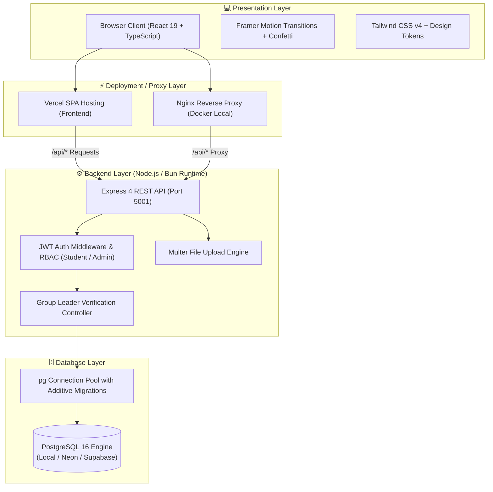
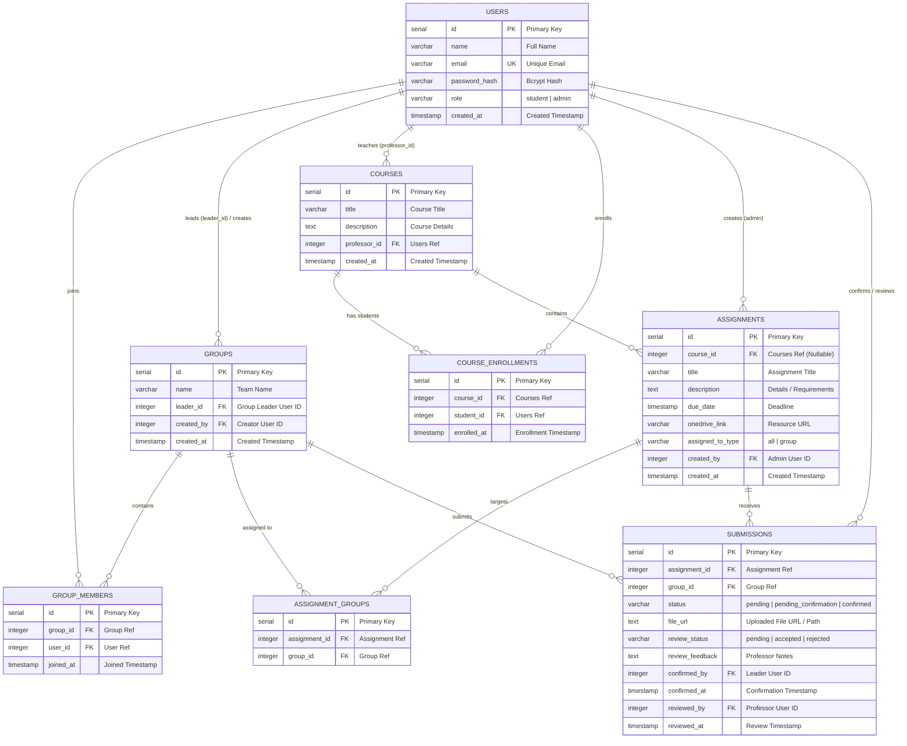

<div align="center">

# 🎓 GroupSync
### *Next-Generation Academic Student, Group & Assignment Management System*

[](https://bun.sh)
[](https://react.dev)
[](https://www.typescriptlang.org)
[](https://expressjs.com)
[](https://www.postgresql.org)
[](https://tailwindcss.com)
[](https://www.docker.com)
[](https://student-group-assignment-system.vercel.app)

<p align="center">
  <b>Course-Centric Hierarchy</b> • <b>Group Leader Acknowledgment</b> • <b>Reversible Submissions</b> • <b>Per-Course Analytics</b> • <b>In-App & Cloud Sync</b>
</p>

[🌐 Live Deployment](https://student-group-assignment-system.vercel.app) • [✨ Round 2 Features](#-round-2-enhancements) • [🏛 Architecture](#-system-architecture) • [🗄 Database Schema](#-entity-relationship-er-diagram) • [🚀 Quick Start](#-quick-start-guide) • [📡 API Reference](#-rest-api-reference)

---

</div>

## 🌟 Overview

**GroupSync** is a modern, full-stack academic platform engineered to eliminate group project chaos in universities and educational institutions.

It allows students to organize into collaborative teams, enroll in courses, upload project deliverables, and execute role-verified two-step submissions. Professors and administrators gain deep per-course analytics, automated assignment distribution, and grading/review workflows with live feedback loops.


## ✨ Feature Breakdown

<table>
  <tr>
    <td width="50%" valign="top">
      <h3>🧑‍🎓 Student Portal</h3>
      <ul>
        <li>📚 <b>Course Catalog & Enrolled Grid</b>: Browse available courses, self-enroll with 1-click, and filter assignments by course.</li>
        <li>👥 <b>Team Management & Roster</b>: Create groups, designate leaders, invite classmates by email, and inspect member roles.</li>
        <li>📤 <b>Role-Verified Two-Step Submissions</b>:
          <ul>
            <li><b>Step 1 (Any Member)</b>: Attach files (PDF, DOCX, images) or cloud links & confirm upload.</li>
            <li><b>Step 2 (Leader Only)</b>: Review team checklist and execute final confirmation with celebration confetti.</li>
            <li><b>Retract / Unsubmit</b>: Leaders can retract submissions anytime prior to grading for last-minute revisions.</li>
          </ul>
        </li>
        <li>⚡ <b>Feedback & Revisions</b>: View instructor grade status (Accepted/Rejected) and read contextual feedback.</li>
      </ul>
    </td>
    <td width="50%" valign="top">
      <h3>🛡️ Professor & Admin Suite</h3>
      <ul>
        <li>📊 <b>Per-Course Analytics Dashboard</b>: Real-time student count, active groups, completion rates, and submission breakdowns.</li>
        <li>📖 <b>Course & Curriculum Management</b>: Create academic courses, manage student enrollments, and assign course materials.</li>
        <li>📝 <b>Assignment Lifecycle</b>:
          <ul>
            <li>Create course-bound assignments (Broadcast to all or targeted to select teams).</li>
            <li>Schedule deadlines and attach OneDrive/Drive resource URLs.</li>
          </ul>
        </li>
        <li>🔍 <b>Submission Tracker & Grading</b>: Review submitted files, mark submissions as <b>Accepted</b> or <b>Rejected</b>, and leave revision feedback.</li>
      </ul>
    </td>
  </tr>
</table>

---

## 🏛 System Architecture



---

## 🗄 Entity-Relationship (ER) Diagram



---

## 🛠 Tech Stack & Tooling

| Domain | Technology | Description |
|---|---|---|
| **Runtime & Toolchain** |  / Node.js | Fast JavaScript/TypeScript execution runtime |
| **Frontend Framework** |  + Vite | Declarative, component-driven SPA interface |
| **Language** |  | Full-stack strict type safety |
| **Styling & Design** |  | Utility CSS with custom academic design tokens |
| **Animations** |  + GSAP | Smooth layout transitions, toasts, and confetti effects |
| **Backend API** |  | RESTful API server with route modularization |
| **Database** |  | Relational database with indexes & aggregate queries |
| **Security & Auth** |  | Role-based token authentication & BCrypt password hashing |
| **Containerization** |  | Multi-container setup for local development |

---

## 🚀 Quick Start Guide

### 📦 Option 1: Docker Compose (Single Command)

Run the entire platform locally with zero prerequisites other than Docker:

```bash
# 1. Clone the repository
git clone https://github.com/Rishu7011/student-group-assignment-system.git
cd student-group-assignment-system

# 2. Build and launch all containers
docker-compose up --build -d
```

🎉 **Access Points:**
- 🌐 **Web App**: [http://localhost:5173](http://localhost:5173) (or [http://localhost](http://localhost))
- 🔌 **API Health Check**: [http://localhost:5001/api/health](http://localhost:5001/api/health)
- 🗄 **PostgreSQL**: `localhost:5432` (`sgas_db` / `sgas_user` / `sgas_pass`)

---

### 💻 Option 2: Local Development Setup

#### 1. Database Setup
Ensure PostgreSQL is running, then apply migrations:
```bash
psql -U postgres -c "CREATE DATABASE sgas_db;"
psql -U postgres -d sgas_db -f backend/migrations/001_init.sql
psql -U postgres -d sgas_db -f backend/migrations/002_round2.sql
```

#### 2. Seed Realistic Demo Data (Recommended)
Populate the database with 12 demo students, 3 courses, 4 active groups with designated leaders, assignments, and sample submissions:
```bash
cd backend
bun run seed:demo
# or with npm: npx ts-node src/scripts/seedDemo.ts
```

#### 3. Start Backend
```bash
cd backend
bun install
bun run dev
```
*Backend runs on `http://localhost:5001` with automated admin seeding.*

#### 4. Start Frontend
```bash
cd ../frontend
bun install
bun run dev
```
*Frontend runs on `http://localhost:5173` with instant Vite HMR.*

---

## 🔐 Default Demo Accounts

All demo accounts created by `seed:demo` share the unified password: **`Demo@1234`**

| Role | Name | Email | Password | Scope / Group |
|---|---|---|---|---|
| 👑 **System Admin** | System Administrator | `sysadmin@groupsync.internal` | `Adm!n@GrpSync#2024` | Global platform administration & analytics |
| 🧑‍🏫 **Professor** | Prof. Alan Turing | `prof.turing@university.edu` | `Demo@1234` | CS301, CS402, CS204 Course Management |
| 👑 **Student (Leader)** | Alex Rivera | `alex.rivera@university.edu` | `Demo@1234` | Leader of **Group Alpha** (CS301 & CS402) |
| 🧑‍🎓 **Student (Member)** | Sam Taylor | `sam.taylor@university.edu` | `Demo@1234` | Member of **Group Alpha** |
| 👑 **Student (Leader)** | Maya Lin | `maya.lin@university.edu` | `Demo@1234` | Leader of **Group Beta** |
| 🧑‍🎓 **Student (Solo)** | Liam Vance | `liam.vance@university.edu` | `Demo@1234` | Unassigned / Independent Student |

---

## 📡 REST API Reference

### 🔑 Authentication (`/api/auth`)
| Method | Endpoint | Description | Access Level |
|---|---|---|---|
| `POST` | `/api/auth/register` | Register new student profile | Public |
| `POST` | `/api/auth/login` | Authenticate and obtain Bearer JWT | Public |
| `GET` | `/api/auth/me` | Fetch authenticated user session profile | Bearer JWT |

### 📚 Course Operations (`/api/courses`)
| Method | Endpoint | Description | Access Level |
|---|---|---|---|
| `GET` | `/api/courses/mine` | List courses the user is enrolled in (or teaches) | Authenticated |
| `GET` | `/api/courses/all` | List all available academic courses | Authenticated |
| `GET` | `/api/courses/:id` | Get course details, assignments & enrolled students | Authenticated |
| `POST` | `/api/courses` | Create a new course | Admin / Professor |
| `POST` | `/api/courses/:id/enroll` | Self-enroll into a course | Student |
| `GET` | `/api/courses/:id/analytics` | Real-time completion rates & submission breakdowns | Admin / Professor |

### 👥 Group Operations (`/api/groups`)
| Method | Endpoint | Description | Access Level |
|---|---|---|---|
| `GET` | `/api/groups/mine` | List user's active groups with leader indicators | Student |
| `GET` | `/api/groups/all` | List all groups with roster counts | Admin |
| `GET` | `/api/groups/:id` | Fetch group roster, leader metadata, and members | Authenticated |
| `POST` | `/api/groups` | Create team (creator is set as default leader) | Student |
| `POST` | `/api/groups/:id/members` | Invite teammate by email address | Team Member |
| `DELETE` | `/api/groups/:groupId/members/:userId` | Remove member from group | Group Leader / Creator |
| `DELETE` | `/api/groups/:id` | Delete entire student group | Group Leader / Creator |

### 📝 Assignment Management (`/api/assignments`)
| Method | Endpoint | Description | Access Level |
|---|---|---|---|
| `GET` | `/api/assignments` | List assignments (filtered by course / group) | Authenticated |
| `GET` | `/api/assignments/:id` | Fetch assignment specs, cloud links & deadlines | Authenticated |
| `POST` | `/api/assignments` | Create course assignment (Broadcast / Targeted) | Admin |
| `PUT` | `/api/assignments/:id` | Update assignment metadata & group targeting | Admin |
| `DELETE` | `/api/assignments/:id` | Delete assignment & cascade submission records | Admin |

### 📤 Submissions Flow (`/api/submissions`)
| Method | Endpoint | Description | Access Level |
|---|---|---|---|
| `GET` | `/api/submissions/group/:id` | Retrieve assignment submission status for a group | Group Member / Admin |
| `GET` | `/api/submissions/assignment/:id` | Matrix view of all group submissions for an assignment | Admin |
| `POST` | `/api/submissions/:assignmentId/step1` | Step 1: Upload file / attach link & verify readiness | Team Member |
| `POST` | `/api/submissions/:assignmentId/step2` | Step 2: Final submission confirmation | **Group Leader Only** |
| `POST` | `/api/submissions/:assignmentId/unsubmit` | Retract submission to draft state for revision | **Group Leader Only** |
| `PATCH` | `/api/submissions/:assignmentId/groups/:groupId/review` | Grade submission (`accepted`/`rejected`) & leave feedback | Admin / Professor |

### 📁 File Uploads (`/api/upload`)
| Method | Endpoint | Description | Access Level |
|---|---|---|---|
| `POST` | `/api/upload` | Upload assignment deliverable (PDF, DOCX, PNG, etc.) | Authenticated |

---

## 📂 Project Directory Structure

```text
student-group-assignment-system/
├── backend/
│   ├── Dockerfile                  # Multi-stage Bun/Node container image
│   ├── migrations/
│   │   ├── 001_init.sql            # Base schema (users, groups, assignments)
│   │   └── 002_round2.sql          # Round 2 migration (courses, enrollments, leader_id)
│   ├── src/
│   │   ├── config/db.ts            # pg connection pool & auto-migrations
│   │   ├── controllers/            # Auth, Courses, Groups, Assignments, Submissions, Analytics
│   │   ├── middleware/             # JWT verification & RBAC authorization
│   │   ├── routes/                 # Modular Express route definitions
│   │   ├── scripts/
│   │   │   ├── seedAdmin.ts        # Bootstrap system administrator
│   │   │   └── seedDemo.ts         # Comprehensive 12-student demo dataset
│   │   └── server.ts               # Server bootstrap & upload static serving
│   ├── package.json
│   └── tsconfig.json
├── frontend/
│   ├── Dockerfile                  # Production Vite build -> Nginx runner
│   ├── nginx.conf                  # Single Page Application router & proxy
│   ├── public/
│   │   └── favicon.svg             # Custom GroupSync academic graduation emblem
│   ├── src/
│   │   ├── api/client.ts           # Axios instance with JWT interceptors
│   │   ├── components/             # Sidebar, Modals, Steppers, Protection Guards
│   │   ├── context/AuthContext.tsx # User session & role state provider
│   │   ├── pages/                  # CoursePage, StudentDashboard, AdminDashboard, Auth
│   │   ├── index.css               # Material tokens, Tailwind v4 & smooth keyframes
│   │   └── App.tsx                 # Declarative application routing
│   ├── package.json
│   └── vite.config.ts
├── docker-compose.yml              # Multi-container orchestration specification
└── README.md                       # Comprehensive documentation & architecture guide
```

---

## 📄 License

This project is licensed under the **MIT License** — see the [LICENSE](LICENSE) file for details.

<div align="center">
  <sub>Built with ❤️ for academic collaboration using Bun, React 19, TypeScript, PostgreSQL, and Docker.</sub>
</div>
